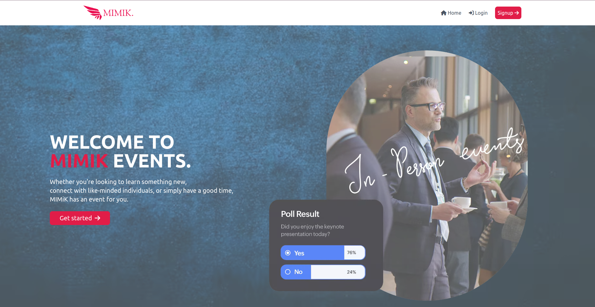

# MIMIK EVENTS

Mimik Events is a mock web application that aims at gathering information on forthcoming
events and present them in a user-friendly manner, thereby assisting individuals in effortlessly
discovering events.

## Built With

This application has been built with the following tools:


- **React `18.2.+`**
- **Ruby `v2.7.+`**
- **SQlite3 `v1.6`**
- **ActiveRecord `v7.0.4`**
- **Rake `v13.0.6`**
- **Puma `v6.1`**
- **Rails `v7.0.4`**
- **active_model_serializers `v0.10.13`**

## Application Features

- User Authentification - A user can signup using their name, email and password, they can also login using their email and password.
- A user can see all upcoming events.
- A user can create, update and delete their events.

## Installation

To run `Mimik Events` in development, you must install:

- **Ruby version 2.7.0**
- **Rails version 6.0.3.4 or later**
- **Node.js version 12.0.0 or later**
- **SQLite version 3.24.0 or later**

1. Clone the Repository:

   ```
   git clone git@github.com:KabiruH/Events-manager.git

   ```

2. Install API Dependencies
   ```
       bundle install
       rails db:migrate
       rails db:seed
   ```
3. Start rails server
   ```
        rails s
   ```
4. Open a new terminal and navigate to the client directory:

   ```
      cd ./mimik-frontend
   ```

5. Install React dependencies
   ```
       npm install
   ```
6. Start React client to open in browser
   ```
     npm run start
   ```

To run it in production, install

- deployment link :

  ```
   https://events-manager-rose.vercel.app/  - front end

   https://event-manager-1mtv.onrender.com - backend

  ```

## Using the Application

1. Sign up or log in to the application to view all events.
2. Add events to the application by clicking on the `Add event` button on the events page.
3. Updating and deleting events from the application is only applicable for events that have been created by the logged in user.

   ```
    Test user data.

     email: user@mail.com
     password: password

    This user has precreated events that can be  used to test `update, delete and create new events.
   ```

## Screenshots

- Hero Page
  
  <br />

- Login
  
  <br />

- Events page

<br />

- Event Details
  
  <br />

## Contributing

This project was contributed to by:

- [Kelvin Kabiru](https://github.com/KabiruH)
- [Iris Thuo](https://github.com/IrisThuo)
- [sainamercy](https://github.com/sainamercy)
- [Mark Mutuku](https://github.com/Tusko97)

```markdown
Copyright 2023
```
